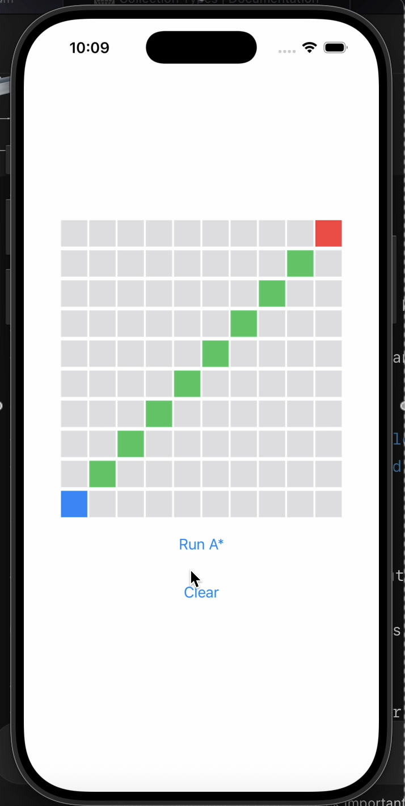
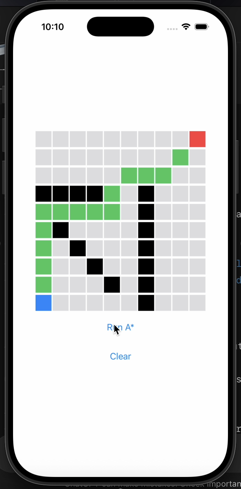
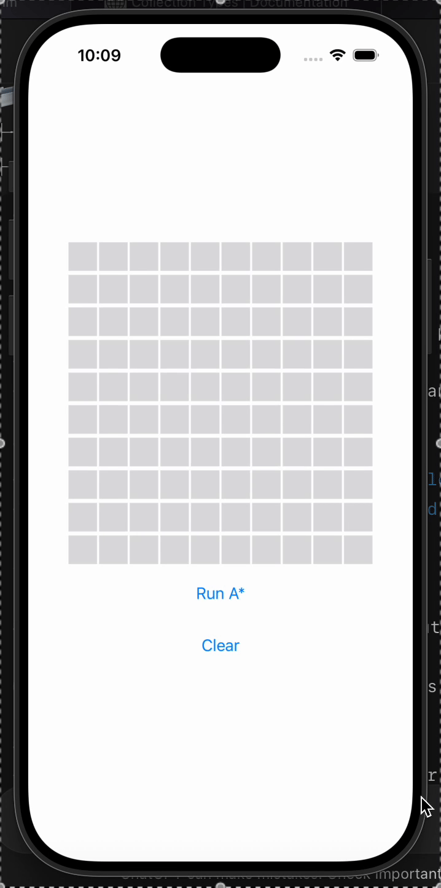

# 🧭 Swift A* Pathfinding Visualizer

An interactive SwiftUI app that demonstrates the **A\*** pathfinding algorithm on a customizable grid.
Click to set a start and goal, and draw walls to block paths!

---

## 🚀 Features

- ✅ Click to set **start** and **goal**
- ✏️ Click to draw **walls**
- 🔍 Finds the shortest path using **A\*** algorithm
- 🧠 Supports 8-directional movement with **octile distance** heuristic
- 💡 Built with **SwiftUI** — reactive and fully interactive

---

## 🖼️ Preview

| Visualization | Walls + Path |
|:--------------:|:-------------:|

|  |  | 

_(Screenshots from live demo)_

---

## 🎥 Demo Video

 |

---

## 🛠️ Technologies

- **Swift** (SwiftUI, Combine)
- **Xcode 16**
- **A\*** algorithm (custom implementation)

---
