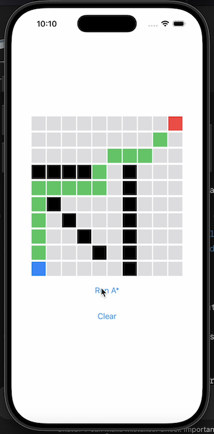

# Swift A* Pathfinding Visualizer

An interactive SwiftUI app that demonstrates the **A\*** pathfinding algorithm on a customizable grid.
Click to set a start and goal, and draw walls to block paths!

---

##  Features

- Click to set **start** and **goal**
- Click to draw **walls**
- Finds the shortest path using **A\*** algorithm
- Supports 8-directional movement with **octile distance** heuristic
- Built with **SwiftUI** — reactive and fully interactive

---

## Preview

| Visualization | Walls + Path |

|:------------------------------------------------------:|:------------------------------------------------------:|

|  |  | 

(Screenshots from live demo)

---

## Demo Video

|  |

---

## Technologies

- **Swift** (SwiftUI, Combine)
- **Xcode 16**
- **A\*** algorithm (custom implementation)

---

